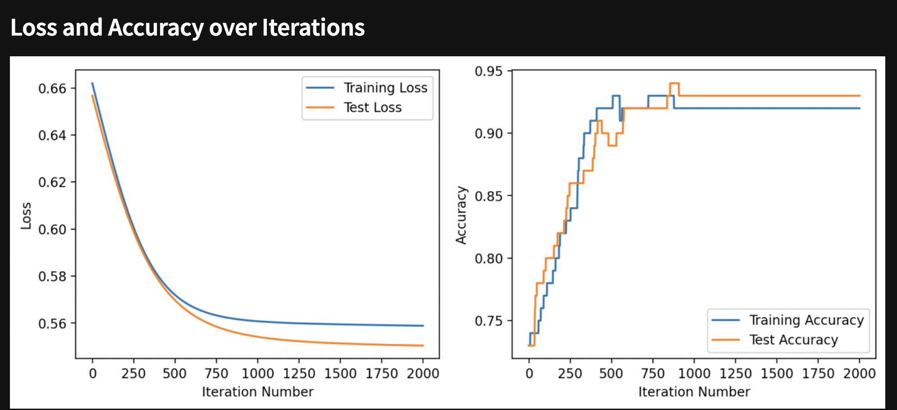
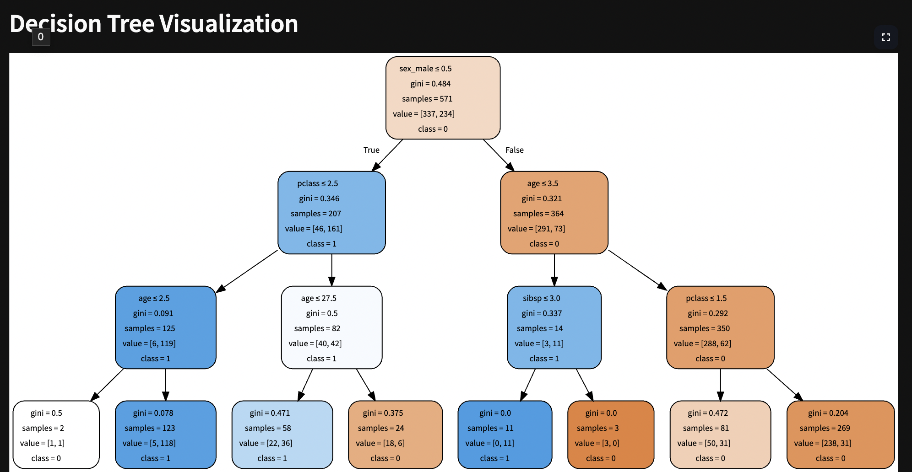

# MLStreamlitApp

## Project Overview

**MLStreamlitApp** is an interactive machine learning application built with Python and Streamlit.  
Its goal is to provide users with a hands-on environment to explore various supervised learning techniques using real or uploaded datasets.  
With this app, you can:

- **Upload your own dataset or use a default one:** For example, use the Titanic dataset for classification, loans data for KNN, etc.
- **Experiment with multiple models:**  
  - **Linear Regression:** Predicts values by fitting a line that minimizes error.
  - **Logistic Regression on a Perceptron:** Classifies data into binary categories using a logistic function.
  - **K-Nearest Neighbors (KNN):** Analyze the impact of feature scaling and the number of neighbors.
  - **Decision Trees:** Visualize tree-based decision-making and understand model splits.
- **Tune Hyperparameters:**  
  Adjust training parameters such as maximum depth for trees, number of neighbors, test split ratio, and more via interactive sliders.
- **View Detailed Performance Metrics:**  
  Metrics include accuracy, F1 score, precision, sensitivity (recall), specificity, ROC curves, AUC, and loss curves.
- **Visualize Results:**  
  Generate intuitive visualizations (e.g., scatter plots, histograms, ROC curves, decision tree graphs) to understand model behavior.

## Instructions

### Running the App Locally

1. **Clone the Repository:**
    ```bash
    git clone https://github.com/yourusername/MLStreamlitApp.git
    cd MLStreamlitApp
    ```

2. **Set Up a Virtual Environment (recommended):**
    ```bash
    python -m venv venv
    source venv/bin/activate   # On Windows: venv\Scripts\activate
    ```

3. **Install the Required Libraries:**  
   Ensure that your `requirements.txt` file is up-to-date. For example, mine includes:
    ```
    graphviz==0.20.3
    matplotlib==3.7.2
    numpy==1.24.3
    pandas==2.0.3
    scikit_learn==1.3.0
    scipy==1.15.2
    seaborn==0.13.2
    statsmodels==0.14.0
    streamlit==1.41.1
    ```
    Then run:
    ```bash
    pip install -r requirements.txt
    ```

4. **Run the App:**
    ```bash
    streamlit run app.py
    ```
5. **Access the App:**  
   Your default web browser should open the app. If not, navigate to the URL provided by Streamlit (usually `http://localhost:8501`).

### Deployed Version

A deployed version of the app is available   
[here](https://mccollum-data-science-portfolio-u55wb5gn9mbo8ywsxzsrgu.streamlit.app)

## App Features

- **User-Friendly Interface:**  
  Navigate through chapters detailing Linear Regression, Logistic Regression on a Perceptron, KNN, and Decision Trees with a clean sidebar navigation.

- **Data Flexibility:**  
  Upload your own CSV data or use default datasets (e.g., Titanic for classification, loans.csv for KNN).

- **Interactive Model Training:**  
  - **Linear Regression:** Adjust model parameters and view regression plots along with performance metrics such as R².
  - **Logistic Regression on a Perceptron:** Classify random data points using logistic regression and a sigmoid activation function.
  - **KNN:** Explore how different values of k and feature scaling affect the model.
  - **Decision Trees:** Visualize decision tree structures via Graphviz along with performance metrics.
  
- **Hyperparameter Tuning:**  
  Use intuitive sliders and toggles to adjust hyperparameters, split ratios, and more.

- **Meaningful Performance Metrics:**  
  Visualize accuracy, F1 score, precision, recall, specificity, ROC curves, and loss curves to guide model improvement.


## References

- [Streamlit Documentation](https://docs.streamlit.io/)
- [Scikit-learn User Guide](https://scikit-learn.org/stable/user_guide.html)
- [Matplotlib Documentation](https://matplotlib.org/stable/contents.html)
- [Seaborn Documentation](https://seaborn.pydata.org/)
- [Graphviz Documentation](https://graphviz.gitlab.io/)
- [R tidyverse Documentation](https://www.tidyverse.org/)
- [Format followed for linear regression chapter](https://glms-usf-msds601-fall24.streamlit.app/)


## Visual Examples

Below are some screenshots from the app:

  
*Example of the loss curve generatd when applying logistic regression to a simple ANN.*

  
*Example of the decision tree page with Graphviz visualization and interactive depth tuning.*

---


