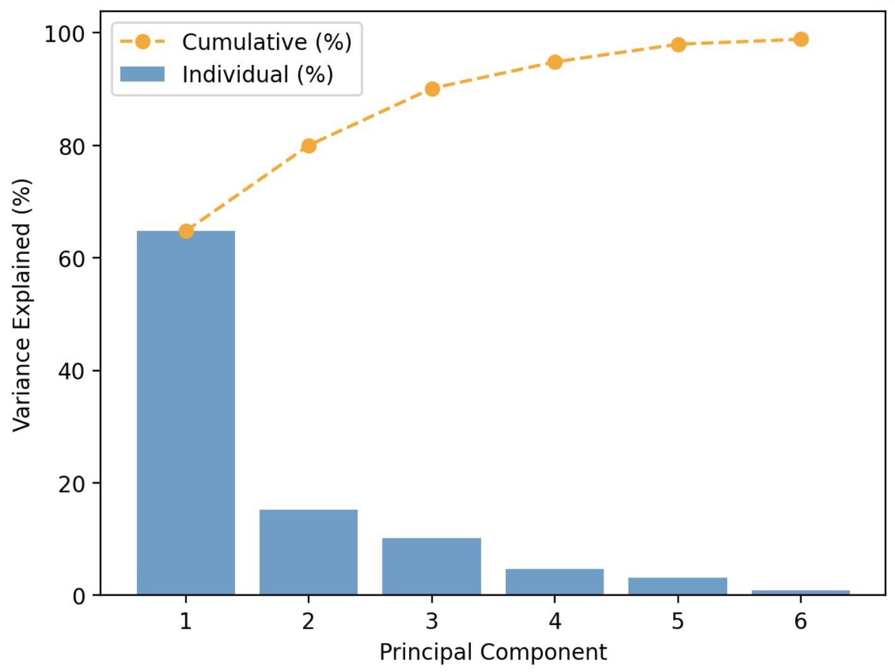
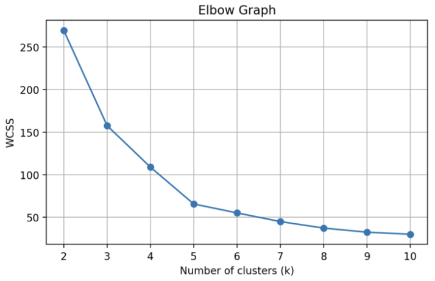
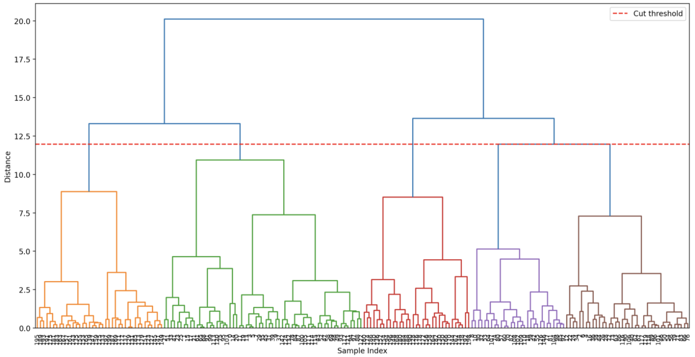

# MLUnsupervisedApp

## Project Overview

**MLUnsupervisedApp** is an interactive machine learning application built with Python and Streamlit.  
Its goal is to provide users with a hands-on environment to explore key unsupervised learning techniques and dimensionality reduction using real or uploaded datasets.  
With this app, you can:

- **Upload your own dataset or use built-in examples:**  
  - Breast Cancer dataset for PCA  
  - Mall Customers and Country Data for clustering

- **Explore Unsupervised Machine Learning Methods:**
  - **Principal Component Analysis (PCA):** Reduce dimensionality while preserving structure. View scree plots, feature loadings, and 2D projections.
  - **K-Means Clustering:** Segment data into user-defined clusters using Euclidean distance. Evaluate model performance using silhouette scores and elbow plots.
  - **Hierarchical Clustering:** Build nested clusters visualized through dendrograms. Apply agglomerative clustering using Ward linkage and visualize groupings in 2D and 3D.

- **Tune Hyperparameters Interactively:**  
  Adjust the number of clusters or principal components and observe how these changes affect structure and performance.

- **Visualize Results Effectively:**
  Scree plots, scatter plots, biplots, dendrograms, and 3D projections help uncover hidden patterns in your data.

## Instructions

### Running the App Locally

1. **Clone the Repository:**
    ```bash
    git clone https://github.com/yourusername/MLUnsupervisedApp.git
    cd MLUnsupervisedApp
    ```

2. **Set Up a Virtual Environment (recommended):**
    ```bash
    python -m venv venv
    source venv/bin/activate   # On Windows: venv\Scripts\activate
    ```

3. **Install the Required Libraries:**
    Ensure your `requirements.txt` file is up-to-date. For example, it may include:
    ```
    matplotlib==3.7.2
    numpy==1.24.3
    pandas==2.0.3
    plotly==5.9.0
    scikit_learn==1.3.0
    scipy==1.15.2
    seaborn==0.13.2
    streamlit==1.41.1
    ```
    Then run:
    ```bash
    pip install -r requirements.txt
    ```

4. **Run the App:**
    ```bash
    streamlit run app.py
    ```

5. **Access the App:**  
   Your browser should open the app automatically. If not, go to `http://localhost:8501`.

### Deployed Version

A deployed version of the app is available  
[here](https://mccollum-data-science-portfolio-izda62b6cn2hvg8xjdzmz6.streamlit.app)

## App Features

- **User-Friendly Interface:**  
  Navigate between PCA, K-Means, and Hierarchical Clustering with a sidebar interface.

- **PCA Features:**
  - Choose how many components to compute.
  - View scree plots, cumulative variance, 2D projections, and biplots.
  - Compare logistic regression accuracy before and after PCA.

- **K-Means Clustering Features:**
  - Select number of clusters via slider.
  - Upload your own dataset or use the Mall Customers dataset.
  - View elbow plot and silhouette scores.
  - Visualize clusters with scatter plots.

- **Hierarchical Clustering Features:**
  - Explore dendrograms interactively with adjustable cluster cut level.
  - Choose between Mall Customers and Country Data.
  - View 2D and 3D cluster projections.
  - Evaluate silhouette score across cluster counts.

- **Educational Explanations:**  
  Each section includes detailed markdown explanations to help users understand what each algorithm does and why it works.

## References

- [Streamlit Documentation](https://docs.streamlit.io/)
- [Scikit-learn User Guide](https://scikit-learn.org/stable/user_guide.html)
- [Matplotlib Documentation](https://matplotlib.org/stable/contents.html)
- [Seaborn Documentation](https://seaborn.pydata.org/)
- [Plotly Documentation](https://plotly.com/python/)


## Visual Examples

Below are a few visualizations generated by the app:

  
*Scree plot showing explained variance by each principal component.*

  
*Elbow method used to find optimal number of K-Means clusters.*

  
*Dendrogram visualizing hierarchical clustering merge steps.*

---
