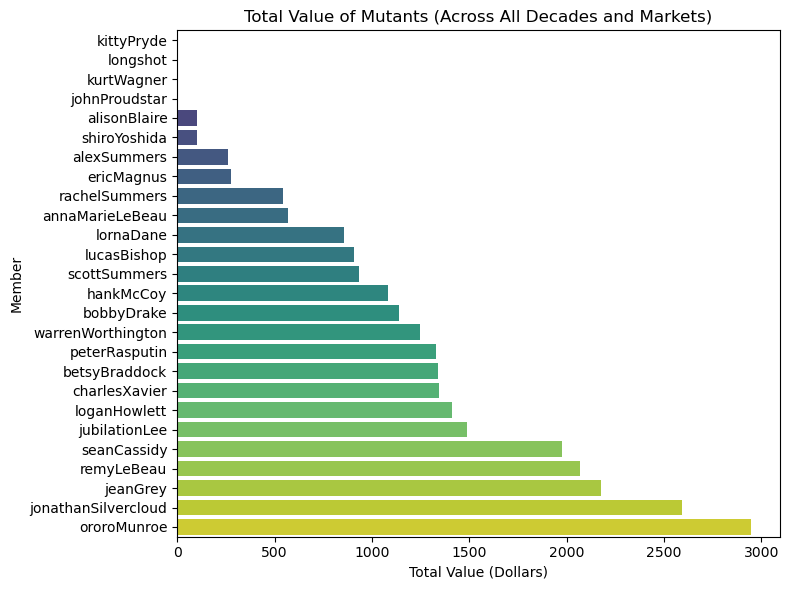

### Tidy Data Project Repository

## Project Overview

This project focuses on transforming a dataset into a "tidy" format to facilitate analysis and visualization. Tidy data principles, as defined by Hadley Wickham, state that each variable should have its own column, each observation its own row, and each type of observational unit its own table. This project demonstrates how one could clean and reorganize data using these principles, allowing for more efficient analysis and better visualizations.

This project uses the Mutant Moneyball dataset [found here](https://github.com/EliCash82/mutantmoneyball/tree/main).

Through this project, the data was transformed from a wide format into a long format, allowing for easier aggregation and visualization of key metrics. The visualizations showcase different patterns of data across decades, markets, and members, such as total value over time and by market.

## Instructions

To run the notebook and replicate the analyses performed in this project, follow these steps:

# 1. Clone the Repository
[Repo Link here](https://github.com/mmccoll03/MCCOLLUM-Data-Science-Portfolio/tree/main/TidyData-Project)

Clone the repo using this URL.

# 2. install dependencies
You can install the required Python packages using `pip` or `conda`. Ensure you have the following dependencies:
- `pandas` for data manipulation
- `matplotlib` and `seaborn` for visualizations
- `numpy` for numerical operations
- `squarify` for treemap visualization
- `plotly` for Sankey Chart

# 3. Run the notebook (tidy_mutants.ipynb)
Once the notebook is open, execute each cell sequentially to observe how the data is transformed, analyzed, and visualized. Each section of the notebook corresponds to a specific part of the data transformation and visualization process.

## Dataset Description

The dataset used in this project contains records of mutant characters, their total values across different decades, and the markets in which they were sold. The original dataset was in a wide format, with separate columns for each decade and market combination. This format required reshaping and cleaning to make the data "tidy."

## Pre-processing Steps:
1. **Melt the dataset**: The original wide-format dataset was melted into a long-format DataFrame, where each row corresponds to a single observation for a member, a specific decade, and a market.
2. **Remove unwanted characters**: Any dollar signs or other characters were stripped from the numerical columns to ensure they were in a numeric format.
3. **Aggregation**: The data was aggregated by different variables (e.g., by market, by decade) to facilitate analysis.
4. **Visualization**: Various visualizations were created to demonstrate trends and relationships within the data.

## References

- [Tidy Data Paper by Hadley Wickham](https://vita.had.co.nz/papers/tidy-data.pdf)
- [Tidy Data Cheat Sheet](https://pandas.pydata.org/Pandas_Cheat_Sheet.pdf)

### Small Streamlit Dashboard

**Use streamlit run streamlit.py**
- This just shows some basic filtering of the melted dataframe. I may come back to this to incorporate further visualizations or a better design, but for right now, it is useful to view the dataframe for what it is. 

### Screenshots 

# Bar Plot of Total Value (Dollars) by 4 different Mutants and Decade and Market

# Bar Plot of Total Value for Mutants in the 90s
